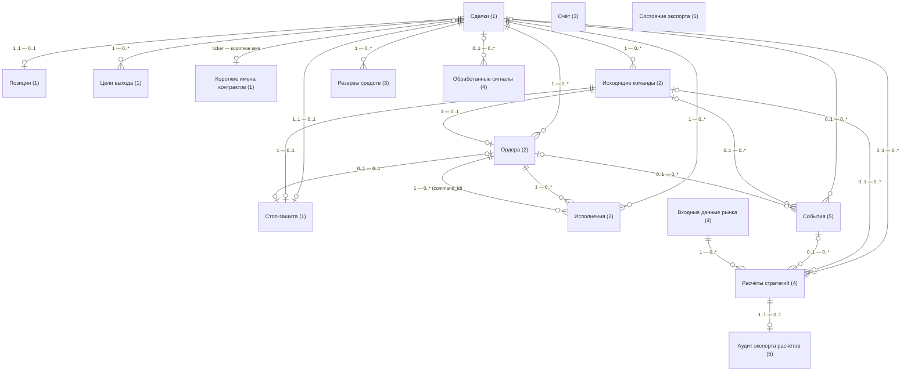
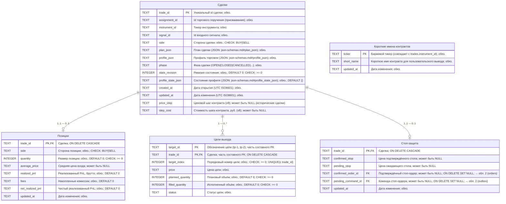
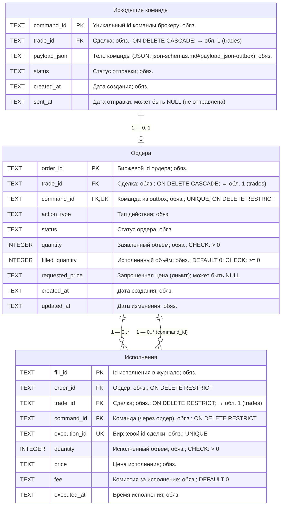
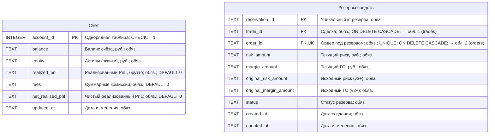
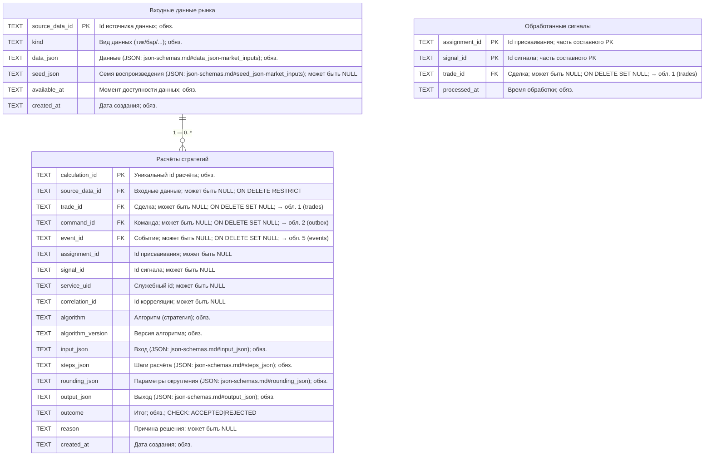
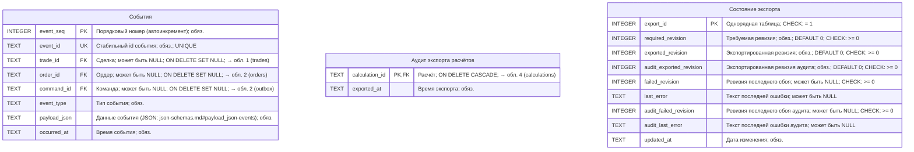

# Схема БД (ER-диаграммы)

Каноническая схема живёт в `src/trade_journal/schema.py` (текущая версия —
`SCHEMA_VERSION = 9`). Данный файл — живое ER-описание той же схемы: обзорная
карта связей и диаграммы по предметным областям с колонками и типами, а также
комментарии о миграциях. Он сверяется с реальной схемой тестом
`tests/unit/trade_journal/test_schema_doc_sync.py` (сверка: таблицы, колонки,
`SCHEMA_VERSION`), поэтому при изменении БД его нужно править вместе со схемой,
иначе тест упадёт.

## Обзор: карта связей между областями

Схема разбита на 5 предметных областей; номер области указан в заголовке
таблицы. Детализация по каждому номеру приведена ниже отдельной диаграммой с
полным набором колонок.

**Области:** 1 — Журнал сделок; 2 — Исполнение и команды брокеру;
3 — Счёт и средства; 4 — Аналитика стратегий; 5 — Аудит и экспорт.

Условные обозначения: `PK` — первичный ключ, `FK` — внешний ключ (связь показана
линией либо помечена как `→ обл. N (таблица)` — таблица из другой области),
`UK` — уникальное ограничение/индекс. В комментарии к колонке: значение на
русском, обязательность (`обяз.` / `может быть NULL`), `DEFAULT`, `CHECK`,
поведение внешнего ключа `ON DELETE`. Порядок колонок в каждом блоке
соответствует `CREATE TABLE` в `schema.py` (`SCHEMA_VERSION = 9`); типы —
`TEXT`/`INTEGER`. JSON-колонки перечислены с ссылкой `json-schemas.md#...` на
структуру документа (см. [JSON-схемы](json-schemas.md)). Ограничений длины строк
на уровне БД нет (все текстовые колонки `TEXT` без `LIMIT`/`VARCHAR(N)`).
Составные первичные ключи:
`targets (trade_id, target_id)` и `processed_signals (assignment_id, signal_id)`.

## 1. Журнал сделок

Карточка сделки: план, позиция, цели выхода и защитный стоп.

Связи `trades` с областями 2–5 (исполнение, счёт, аналитика, аудит) показаны на
обзорной карте; на стороне дочерних таблиц соответствующие FK-колонки помечены
`→ обл. N`.

## 2. Исполнение и команды брокеру

Цепочка command → order → fill: исходящие команды брокеру, заявки и исполнения.

## 3. Счёт и средства

Учёт денег: баланс/эквити счёта и зарезервированные под сделки риск и ГО.

## 4. Аналитика стратегий

Рыночные данные, результаты расчётов стратегий и отметки об обработке сигналов.

## 5. Аудит и экспорт

Служебная трасса: лента событий сделок и состояние экспорта/аудита расчётов.

## Комментарии к ролям связей (по семантике `ON DELETE`)

- `events.trade_id` — `ON DELETE SET NULL`, поэтому сделка может быть
  удалена после события (0..1 — 0..*).
- `audit_exports` — это данные аудита экспорта точных расчётов, 1..1 к
  `calculations` с `ON DELETE CASCADE`.
- `targets` — первичный ключ составной `(trade_id, target_id)`: одинаковые
  текстовые обозначения целей (`tp-1`, `tp-2`) разрешены у разных сделок.
  Также есть `UNIQUE (trade_id, target_index)`.
- На карте связей видно, что `trades` — центральная точка: она связана почти
  со всеми областями; сами связи в детальных диаграммах областей 2–5 возникают
  на стороне дочерних таблиц (помечены `→ обл. N`).

## Версия 8: рублёвая эпоха сделок

В `trades` добавлены `price_step`/`step_cost` — снапшот факторов контракта на
момент открытия сделки (текст, `NULL` для исторических сделок до миграции
v7→v8). По ним reducer считает PnL в рублях
(`direction × (price − avg) / price_step × step_cost × quantity`); у сделок без
факторов PnL остаётся в «сырых» единицах. Миграция v7→v8 выполняется в
`initialize_schema` при открытии БД; если передан `initial_balance` (депозит
робота), счёт пересобирается с этого значения (re-baseline учётного баланса).

## Версия 9: короткие имена контрактов в базе

Добавлена таблица `instrument_names` — карта «биржевой тикер → короткое имя»
(`NGV6` → `NG-10.26`). Раньше карта жила только в памяти процесса: её строил
селектор инструментов и передавал в `Storage.set_names` → экспортёру, поэтому
`trades.instrument_id` содержал сырой тикер, а инструмент, открывший базу вне
работающего робота, не мог показать пользователю короткое имя.

Карта записывается идемпотентным обновлением при `set_names` (один раз за
запуск робота, лишних строк не создаёт). Короткое имя определяется селектором
инструментов, а не разбором тикера: тикер не позволяет однозначно восстановить
имя. Читать карту из базы может любой инструмент в режиме `mode=ro`, без сети
и без интерактивного выбора инструментов. Миграция v8→v9 только создаёт таблицу;
существующие строки не изменяются, а наполнение происходит при первом запуске
робота после обновления. Подробнее — в
[signal-pipeline.md](trade-management/signal-pipeline.md) и в
[storage-and-audit.md](trade-management/storage-and-audit.md).

## Как и когда обновлять

1. Внёс изменение в `CREATE TABLE` / `SCHEMA_VERSION` в `schema.py`?
2. Прогони `tests/unit/trade_journal/test_schema_doc_sync.py` — он сравнит
   таблицы и колонки из этого файла с реальной схемой и укажет расхождения.
3. Обнови обзорную карту и диаграмму соответствующей области — колонки, типы и
   связи.
4. Оформи изменениe через OpenSpec-workflow (delta-спеки в
   `openspec/changes/`), чтобы спека и БД не разошлись.