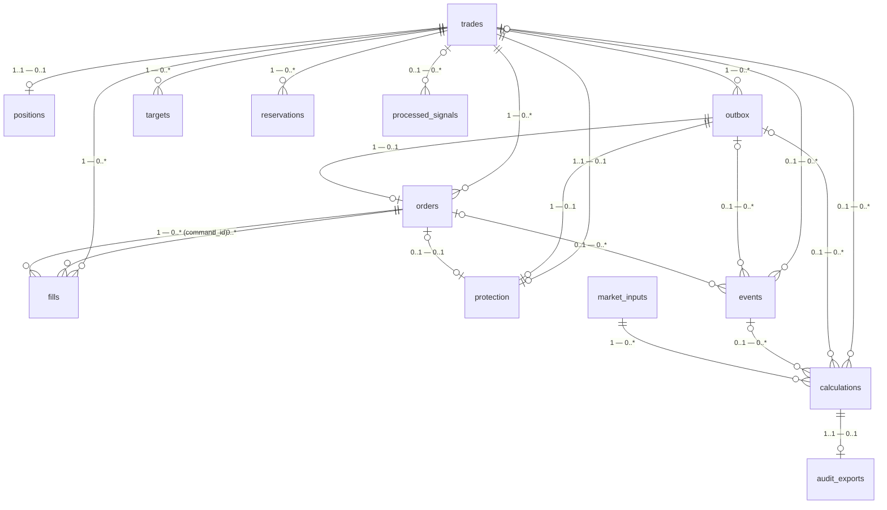

# Схема БД (ER-диаграмма)

Каноническая схема живёт в `src/trade_journal/schema.py` (текущая версия —
`SCHEMA_VERSION = 7`). Данный файл — живое ER-описание той же схемы: диаграмма,
перечень таблиц и колонок, миграции. Он сверяется с реальной схемой тестом
`tests/unit/trade_journal/test_schema_doc_sync.py` (сверка: таблицы, колонки,
`SCHEMA_VERSION`), поэтому при изменении БД его нужно править вместе со схемой,
иначе тест упадёт.

## ER-диаграмма



## Перечень таблиц и колонок

Порядок колонок значим и соответствует `CREATE TABLE` в `schema.py`
(`SCHEMA_VERSION = 7`). `PK` — первичный ключ.

```text
<!-- schema-tables-start -->
account: account_id, balance, equity, fees, net_realized_pnl, realized_pnl, updated_at
audit_exports: calculation_id, exported_at
calculations: algorithm, algorithm_version, assignment_id, calculation_id, command_id, correlation_id, created_at, event_id, input_json, outcome, output_json, reason, rounding_json, service_uid, signal_id, source_data_id, steps_json, trade_id
events: command_id, event_id, event_seq, event_type, occurred_at, order_id, payload_json, trade_id
export_state: audit_exported_revision, audit_failed_revision, audit_last_error, export_id, exported_revision, failed_revision, last_error, required_revision, updated_at
fills: command_id, executed_at, execution_id, fee, fill_id, order_id, price, quantity, trade_id
market_inputs: available_at, created_at, data_json, kind, seed_json, source_data_id
orders: action_type, command_id, created_at, filled_quantity, order_id, quantity, requested_price, status, trade_id, updated_at
outbox: command_id, created_at, payload_json, sent_at, status, trade_id
positions: average_price, fees, net_realized_pnl, quantity, realized_pnl, side, trade_id, updated_at
processed_signals: assignment_id, processed_at, signal_id, trade_id
protection: confirmed_order_id, confirmed_stop, pending_command_id, pending_stop, trade_id, updated_at
reservations: created_at, margin_amount, order_id, original_margin_amount, original_risk_amount, reservation_id, risk_amount, status, trade_id, updated_at
targets: filled_quantity, planned_quantity, price, status, target_id, target_index, trade_id
trades: assignment_id, created_at, instrument_id, phase, plan_json, profile_json, profile_state_json, side, signal_id, state_revision, trade_id, updated_at
<!-- schema-tables-end -->
```

Комментарии к ролям связей (по семантике `ON DELETE`):

- `events.trade_id` — `ON DELETE SET NULL`, поэтому сделка может быть
  удалена после удаления (0..1 — 0..*).
- `audit_exports` — это данные аудита экспорта точных расчётов, 1..1 к
  `calculations` с `ON DELETE CASCADE`.
- `targets` — первичный ключ составной `(trade_id, target_id)`: одинаковые
  текстовые обозначения целей (`tp-1`, `tp-2`) разрешены у разных сделок.
  Также есть `UNIQUE (trade_id, target_index)`.

## Как и когда обновлять

1. Внёс изменение в `CREATE TABLE` / `SCHEMA_VERSION` в `schema.py`?
2. Прогони `tests/unit/trade_journal/test_schema_doc_sync.py` — он сравнит
   таблицы и колонки из этого файла с реальной схемой и укажет расхождения.
3. Обнови соответствующие строки в перечне и (при необходимости) ER-диаграмму.
4. Оформи изменениe через OpenSpec-workflow (delta-спеки в
   `openspec/changes/`), чтобы спека и БД не разошлись.
