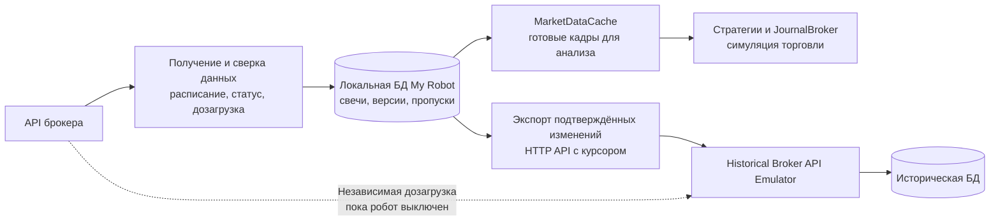

# Рыночные данные текущего режима My Robot

> Проектное решение change
> `openspec/changes/durable-live-market-data-and-emulator-export`.
> Реализованы БД, версии свечей, сверка расписания и `trading_status`,
> фоновый приём, восстановление старейшей дыры и защита последовательной
> минутной симуляции.

## Зачем нужен отдельный контур

My Robot получает текущие свечи напрямую от брокера и моделирует торговлю
через `JournalBroker`. Historical Broker API Emulator хранит собственную
историю для прогонов. Локальная БД робота фиксирует именно те данные и версии,
которые были доступны ему во время текущей симуляции; эмулятор дополнительно
дозагружает периоды, когда робот не работал.

Посредника на пути текущих данных к роботу нет. Прямой связи для реальной
отправки торговых заявок к брокеру в этой архитектуре тоже нет.

## Обязанности компонентов

**Получение и сверка данных.** От брокера принимаются свечи с UID инструмента,
источником, временем открытия и признаком завершённости. Информация о
расписании секции и торговом статусе инструмента помогает определить, какие
интервалы ожидать. Закрытие сессии отменяет ожидание будущих внесессионных
свечей, но не проверку последнего часа уже прошедших торгов. Если свеча внутри
торгового интервала отсутствует, приёмник дозапрашивает этот диапазон даже
тогда, когда пробел старше обычного окна обновления свежих баров. Пустой ответ
не означает, что сделок не было.

**Локальная БД.** Отдельный файл `market-data.sqlite3` в каталоге текущего
состояния робота хранит свечи, их версии, состояния интервалов, основания
проверки и журнал изменений. Свеча записывается до появления в торговом
контуре. `trades.sqlite3` продолжает хранить сделки и факты их исполнения,
не становясь архивом всех рыночных свечей.

По умолчанию путь в разработке — `<корень проекта>/data/market-data.sqlite3`.
В собранном приложении это `data/market-data.sqlite3` рядом с исполняемым
файлом. Если в конфигурации изменён `data_dir`, новая БД следует тому же
каталогу, что и `trades.sqlite3`. БД принадлежит текущему режиму: отдельные
каталоги исторических прогонов под `HIST` не создают в ней копий свечей и не
пишут в неё во время воспроизведения истории.

Логические таблицы и их назначение:

| Данные | Для чего нужны |
| --- | --- |
| `source_identity` | Постоянный `producer_id` этой локальной БД и версия схемы. |
| `candle_versions` | История завершённых версий OHLCV по источнику, UID, интервалу и времени открытия. |
| `interval_coverage` | Текущее состояние минуты, источник и время основания классификации. |
| `source_observations` | Полученные расписания и торговые статусы для объяснения решений о покрытии. |
| `market_cursors` | Независимые границы полученных, разрешённых и обработанных симулятором минут. |
| `change_log` | Неизменяемые изменения с возрастающим `change_id` для экспорта. |
| `consumer_checkpoints` | Последний курсор, который каждый потребитель подтвердил после записи у себя. |

Новая версия свечи и соответствующий `change_log` сохраняются одной
транзакцией. После сбоя можно вновь прочитать незавершённую обработку.
Неподтверждённые эмулятором изменения не удаляются обычной очисткой; длительное
отставание требует диагностики свободного места и связи. Отдельная БД сделок
не даёт общей транзакции с рыночной БД, поэтому исполнение использует
сохранённый вход, безопасный курсор и повторяемую без двойного результата
обработку.

**`MarketDataCache`.** Этот модуль остаётся быстрым рабочим кадром для
стратегий. Новая роль: читать уже сохранённые завершённые свечи и учитывать
состояние покрытия, а не решать по максимальному времени кадра, что все
предшествующие минуты получены. Само расследование пропусков и работа с
расписанием находятся в компоненте получения и локальном хранилище.

**Симуляция.** Минуты проверок стопов и целей применяются по возрастанию
времени. Если между 12:00 и 12:02 неизвестна ожидаемая 12:01, робот может
сохранить 12:02, но не объявляет защиту проверенной до разрешения 12:01.
Ночное окно вне сессии можно пройти без искусственных свечей. Отставание и
неразрешённое покрытие показываются отдельно от результата сделки.

### Как находятся и устраняются пропуски

1. Приёмник получает свечу вместе с `is_complete`. Незавершённая версия
   не поступает в торговый анализ. Завершённая версия сохраняется в локальной
   БД, включая её исходное время и время получения роботом.
2. Для уже завершившихся интервалов приёмник сопоставляет применимое
   расписание секции и наблюдавшийся `trading_status` инструмента. Вне сессии
   он не ожидает новую свечу; изменение статуса не доказывает, что поздних
   данных за предыдущую сессию не будет.
3. Внутри сессии отсутствие 12:01 при наличии 12:02 создаёт `pending`.
   Новую 12:02 можно принять и сохранить, но граница безопасной обработки
   останавливается перед 12:01.
4. Отдельная очередь запрашивает ограниченные окна истории вокруг самой
   ранней дыры. Она продолжает работу и после того, как дыра вышла за часовой
   предел частого обновления свежих свечей. Ошибка API или пустой ответ
   оставляют интервал неразрешённым.
5. Поздняя 12:01 сохраняется независимо от уже полученной 12:02. Кэш
   перестраивает кадр в порядке времени, а симуляция применяет 12:01 и
   затем 12:02. Если источник документированно подтвердил отсутствие сделок,
   интервал можно пройти без искусственной свечи.
6. Исправление уже обработанной минуты становится новой версией и уходит
   в эмулятор. Подтверждённые исполнения прежнего прогона не переписываются.

`MarketDataCache` показывает рабочий кадр и доступное покрытие; расписание,
запросы повторов и очередь дыр ведёт приёмник с хранилищем. Робот измеряет
отставание между полученной и обработанной границей и сообщает, когда
симуляция ждёт данные. При отсутствии убедительного свидетельства, что
сделок не было, строгий режим остаётся на этой границе вместо догадки.

**Экспорт.** Эмулятор читает подтверждённые изменения через API My Robot,
сохраняет их в собственную БД и только после этого подтверждает курсор.
Позднее исправление старой свечи получает новый номер изменения и не теряется
при чтении «после последней свечи». Подробный порядок и примеры запросов — в
[инструкции подключения](emulator-integration.md), машинный контракт — в
[OpenAPI (Swagger)](openapi.yaml).

## Состояние времени и полноты

У каждой пары «источник — инструмент — таймфрейм» есть независимые границы:

| Граница | Что означает |
| --- | --- |
| Последнее полученное изменение | Что уже поступило в локальную БД |
| Последний разрешённый интервал | До какого времени нет неизвестных ожидаемых интервалов |
| Последняя обработанная минута | Что уже надёжно применено симуляцией |
| Последний подтверждённый экспорт | Что эмулятор сохранил в собственной БД |

Состояние отдельного интервала бывает `received`, `scheduled_closed`,
`confirmed_no_trade`, `pending` или `unresolved`. Отсутствие сделок требует
доказательства полноты источника; при его отсутствии остаётся `unresolved`.
Время открытия свечи хранится в UTC, а версия и время получения позволяют
повторить именно тот набор данных, который видел робот.

Поздняя корректировка уже исполненной минуты записывается и экспортируется как
новая версия. Она не переписывает подтверждённую сделку задним числом:
пересчёт выполняется отдельным историческим прогоном.

## Как вводить решение

В текущем режиме фоновый приём продолжает опрашивать источник во время
расчёта стратегий. Приёмник сохраняет расписание и `trading_status`, помечает
дыру в открытой сессии и на следующих циклах запрашивает её отдельным
ограниченным окном. Кэш не выдаёт данные после первой неразрешённой минуты,
а симулятор продвигает durable курсор только после commit фактов сделки.
Исторический режим продолжает использовать существующий клиент эмулятора и
виртуальные часы.
