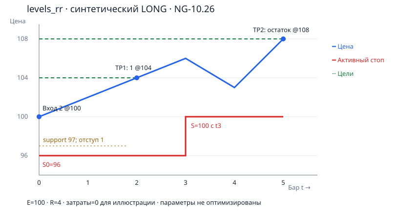
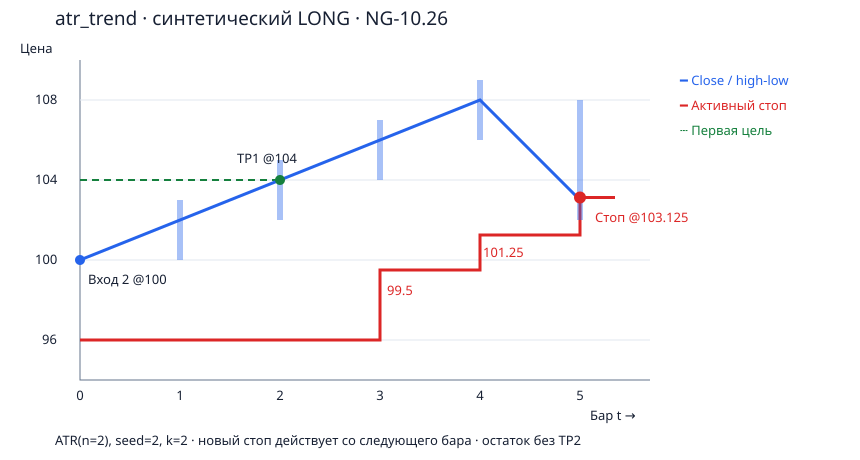
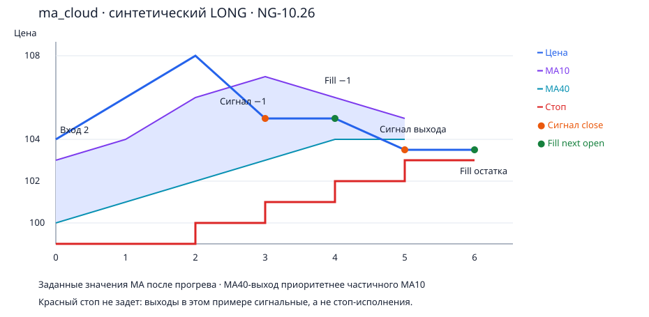
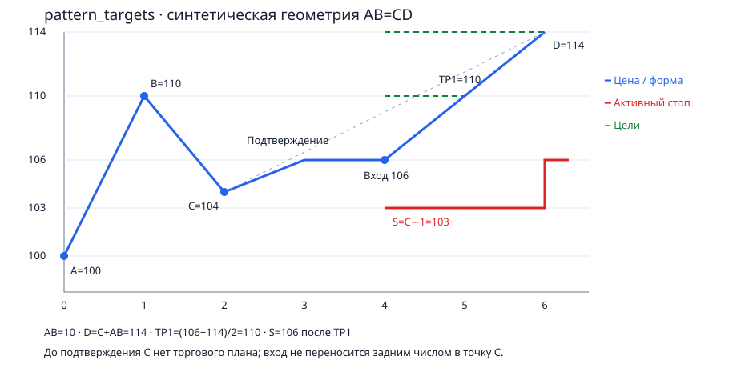

# Четыре профиля управления сделкой

Профиль управления сделкой (поле `management` в привязке) определяет, как робот
ведёт сделанную сделку после входа: где стоит защитный стоп, какие ценовые цели
брать, когда разрешён добор (scale-in) и как происходят частичные и полные выходы.
Входной сигнал даёт стратегия, а сопровождение — только профиль; стратегия больше
не управляет «виртуальной» позицией.

Профили задаются в `[trade_management.profiles.<имя>]` секции `robot.toml`.
Полный рабочий пример конфигурации — `default.toml` в корне проекта (он же
вшивается в сборку, если `robot.toml` рядом с бинарником нет).

Минимум привязки (`[strategies.share.<ТИКЕР>]`/`[strategies.future.<БАЗА>]`):

```toml
[strategies.future.NG]
strategies = [
    { id = "future-ng-macd", name = "macd_rsi_stoch", management = "levels_rr", filter = "raw", tf = "15m", priority = 10 },
    { id = "future-ng-ma",   name = "ma_cloud_rsi_macd", management = "ma_cloud", tf = "1h", priority = 10 },
]
```

- `id` — глобально уникальный непустой идентификатор связки (владелец сделки);
- `name` — имя стратегии входа;
- `management` — имя профиля из `[trade_management.profiles.*]`;
- `filter` — опциональный профиль фильтрации входных сигналов (`raw`/`basic_levels`/`triple_screen`);
- `tf` — таймфрейм задачи (каскад: `tf` → `timeframe` тикера → глобальный);
- `priority` — целый приоритет, по нему распределяется бюджет портфельного риска
  между кандидатами одного тика (по убыванию).

Инструменты сопровождения зависят от таймфрейма сохранённого профиля и не исчезают,
если связку убрать из новых входов: открытая сделка сопровождается по снимку профиля.

## Общие соглашения

- Графики ниже — иллюстрации LONG на условном NG-10.26, не реальные котировки и не
  бэктест доходности.
- Синяя линия — выбранные цены; красная ступень — **активный** защитный стоп;
  зелёный пунктир — ценовые цели.
- Изменение стопа, вычисленное на закрытии бара `t`, показывается активным с `t+1`.
- Точка закрытия части выхода — исполнение команды, а не условное касание.
- Комиссии/проскальзывание в этих четырёх картинках опущены (потому BE = цене входа);
  боевые расчёты учитывают расходы и переносят стоп в покрытие расходов.

## 1. levels_rr — уровень, отступ и две цели



Стоп ставится за ближайшим уровнем поддержки/сопротивления с отступом в тиках;
цели — по соотношению 1:1 и 1:2 к первоначальному риску. Если нужного уровня нет —
сделка **отклоняется** (никакого fallback «2% от цены»). Доборы выключены.
После первой цели стоп остатка переносится в безубыток с учётом расходов
(cost-aware BE).

Пример: E=100, support=97, tick=1, buffer=1 тик. S=97−1=96, R=100−96=4,
TP1=104, TP2=108. По одному контракту на цель. В `t2` исполнен TP1, с `t3` стоп=100.

| t | Цена на схеме | Активный стоп | Действие |
|---|---|---:|---|
| 0 | 100 | 96 | Вход 2 |
| 1 | 102 | 96 | Удержание |
| 2 | 104 | 96 | TP1: закрыть 1, рассчитать BE |
| 3 | 106 | 100 | Новый стоп активен |
| 4 | 103 | 100 | Стоп не ослабляется |
| 5 | 108 | 100 | TP2: закрыть остаток |

SHORT зеркален: E=100, resistance=103, S=104, цели 96/92.

## 2. atr_trend — ATR-стоп и трейлинг остатка



Первоначальный стоп — `initial_k × ATR` (Wilder, `atr_period`, по умолчанию 14).
Первая цель TP1 закрывает долю `tp1_share`, остаток ведётся монотонным трейлингом
`trail_k × ATR`. Доборы (`max_adds`, `add_fraction`) разрешены только до первой
фиксации и только прибыльной позиции; усреднение убытка запрещено. Единственный
контракт (Q=1) не остаётся с первоначальным стопом: при касании TP1-порога
активируется сопровождение без исполнения нулевой заявки.

Числа из примера (n=2 вместо рабочего 14, seed ATR=2): S0=96, TP1=104, далее
кандидаты трейлинга 99.5 → 101.25 → 103.125. `TR_t=max(H−L,|H−C_prev|,|L−C_prev|)`,
`ATR_t=((n−1)·ATR_prev+TR_t)/n`.

| t | O | H | L | C | TR | ATR | Активный S | Кандидат на следующий бар |
|---|---:|---:|---:|---:|---:|---:|---:|---|
| 0 | 100 | 100 | 100 | 100 | — | 2 (seed) | 96 | Трейлинг ещё выключен |
| 1 | 100 | 103 | 100 | 102 | 3 | 2.5 | 96 | Трейлинг ещё выключен |
| 2 | 102 | 105 | 102 | 104 | 3 | 2.75 | 96 | TP1; 105−2×2.75=99.5 |
| 3 | 104 | 107 | 104 | 106 | 3 | 2.875 | 99.5 | 107−2×2.875=101.25 |
| 4 | 106 | 109 | 106 | 108 | 3 | 2.9375 | 101.25 | 109−2×2.9375=103.125 |
| 5 | 108 | 108 | 102 | 103 | 6 | 4.46875 | 103.125 | Стоп остатка внутри бара; нового переноса нет |

## 3. ma_cloud — защитный стоп и сигнальные выходы



Профиль MA Cloud ведёт сделку по облаку SMA 10/40. Защитный стоп — за облаком с
отступом (`min(MA10,MA40)−1 tick` для LONG, зеркально для SHORT), никогда не
понижается. Сигнальные выходы проверяются по закрытию на таймфрейме профиля:
- закрытие под MA40 → **полный** выход (приоритет, если нарушено одновременно и MA10);
- закрытие под MA10 (для >1 контракта) → частичный выход по фактическому объёму
  (1 контракт на бар);
- добор на прибыльном ретесте облака — `floor(0.5×Q)`, только до первой фиксации.

В примере lows выше активной защиты (защитный стоп не исполняется). В `t3`
close<MA10 → команда частичного выхода; исполнение на открытии `t4`=105.
В `t5` close<MA40 → команда полного выхода; исполнение на открытии `t6`=103.5.

| t | Цена/close | MA10 | MA40 | Активный S | Событие |
|---|---:|---:|---:|---:|---|
| 0 | 104 | 103 | 100 | 99 | Вход 2 |
| 1 | 106 | 104 | 101 | 99 | Следующий S=100 |
| 2 | 108 | 106 | 102 | 100 | Следующий S=101 |
| 3 | 105 | 107 | 103 | 101 | Сигнал сократить 1; следующий S=102 |
| 4 | 105 | 106 | 104 | 102 | Исполнено на open; остаток 1; следующий S=103 |
| 5 | 103.5 | 105 | 104 | 103 | Сигнал закрыть остаток по MA40 |
| 6 | 103.5 (open) | — | — | 103 до выхода | Полное исполнение |

## 4. pattern_targets — AB=CD и граница отмены



Профиль требует подтверждённой формации AB=CD (`capability`: ориентиры C/D доступны
только после правого окна C). A=100, B=110, C=104, AB=10, проектируемая D=C+AB=114.
Ориентиры передаёт стратегия `harmonic_abcd`; профилю без подтверждённой геометрии
или при цене входа за D план отклоняется. Отступ=1, S=C−1=103; цели TP1=110
(середина до D), TP2=114. После TP1 стоп остатка переносится к 106 (cost-aware BE),
D не пересчитывается. Доборы выключены.

| Точка / t | Цена | Стоп | Примечание |
|---|---:|---:|---|
| A / 0 | 100 | — | Начало AB |
| B / 1 | 110 | — | AB=10 |
| C / 2 | 104 | — | Ещё нет подтверждения |
| confirm / 3 | 106 | — | План; без ретроактивного входа на C |
| entry / 4 | 106 | 103 | Первый доступный вход, 2 контракта |
| TP1 / 5 | 110 | 103 | Закрытие 1, запрошен S=106 |
| D / 6 | 114 | 106 | Закрытие остатка |

SHORT зеркален: A=110, B=100, C=106, D=96, E=104, S=107, TP1=100, TP2=96.

## Таблицы сверены с unit-кейсами

Числа таблиц выше — контрольные значения unit-тестов, а не расчёт каждой функции
той же функцией:

| Пример | Unit-модуль | Независимые ожидания |
|---|---|---|
| levels_rr | `tests/unit/trade_management/test_levels_rr.py` | 96/104/108; SHORT 104/96/92 |
| atr_trend | `tests/unit/trade_management/test_atr_trend.py` | TR/ATR из таблицы, стопы 99.5/101.25/103.125, Q=1 |
| ma_cloud | `tests/unit/trade_management/test_ma_cloud.py` | Стопы 99→103, полный приоритет MA40, частичный по фактическому Q |
| pattern_targets | `tests/unit/trade_management/test_pattern_targets.py` | 103/110/114 и зеркальный SHORT, время доступности C |

## Где лежат параметры

```toml
[trade_management.profiles.levels_rr]
type = "levels_rr"
buffer_ticks = 1
target_R = [1.0, 2.0]
shares = [0.5, 0.5]
max_adds = 0

[trade_management.profiles.atr_trend]
type = "atr_trend"
atr_period = 14
initial_k = 2.0
trail_k = 2.0
tp1_R = 1.0
tp1_share = 0.5
max_adds = 2
add_fraction = 0.5
advance_R = 0.5

[trade_management.profiles.ma_cloud]
type = "ma_cloud"
ma_fast_period = 10
ma_slow_period = 40
buffer_ticks = 1
max_adds = 2
add_fraction = 0.5

[trade_management.profiles.pattern_targets]
type = "pattern_targets"
buffer_ticks = 1
fractions_to_D = [0.5, 1.0]
shares = [0.5, 0.5]
max_adds = 0
```

Параметры валидируются до торгового цикла: нечисловые/нефинитные уровни, доли с
суммой больше 1, отрицательные отступы, дубли ID связок и несовместимые пары
«стратегия–профиль» отклоняются с указанием файла и ключа.

Полные численные выкладки и исходные описания — в спецификации правки
`openspec/changes/add-trade-management-profiles/examples/profiles.md`; картинки
отсюда — файлы `docs/trade-management/*.svg`.

Про руководство по файлам в хранилище (SQLite, CSV-экспорт, аудит) — см.
[storage-and-audit.md](storage-and-audit.md).