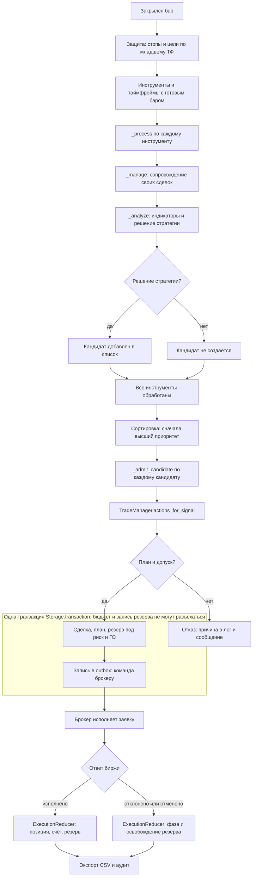
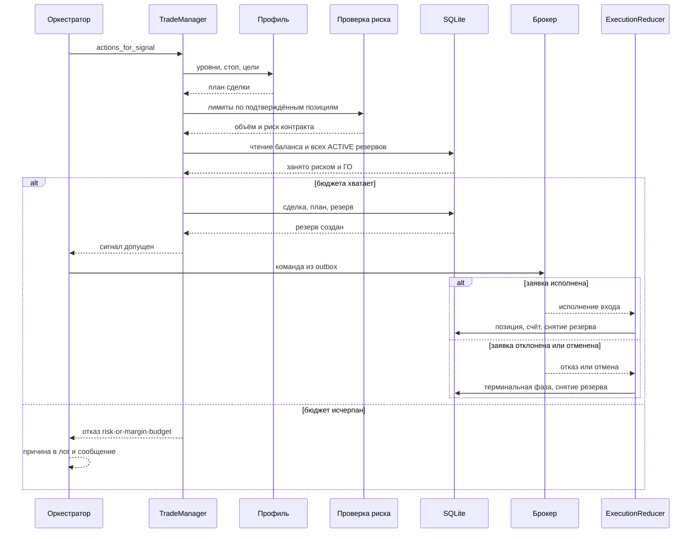
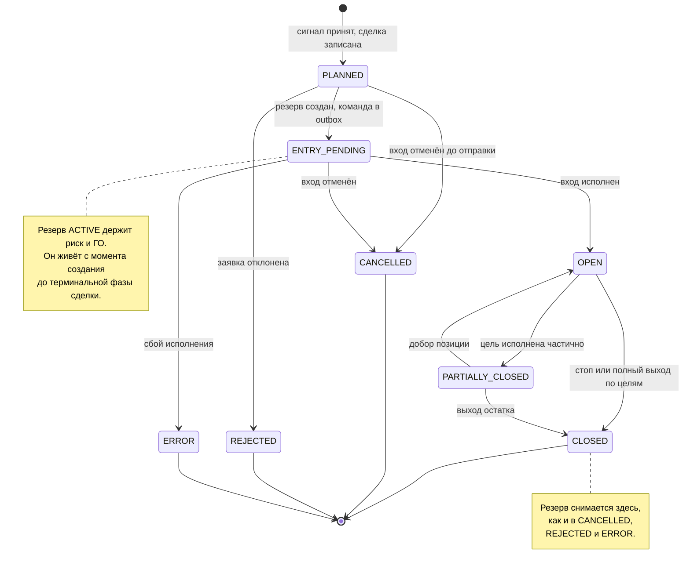

# Конвейер сигнала: от решения до исполнения

Документ отвечает на два вопроса, которые не закрывает ни один другой файл
репозитория:

1. **Что происходит с сигналом по шагам** — от закрытия бара до записи в журнал.
2. **Кто за что отвечает** — какой компонент владеет состоянием, кто имеет
   право его менять, а кто только читает.

Смежные документы: [profiles.md](profiles.md) — как профили выбирают уровни,
стоп и цели; [storage-and-audit.md](storage-and-audit.md) — как устроено
хранение, экспорт и аудит; [../database.md](../database.md) — схема БД.

Живое состояние базы смотрится утилитой `tools/show_state.py` (раздел 5).

---

## 1. Порядок шагов тика

Один тик оркестратора проходит через инструменты и таймфреймы в строгом
порядке. Порядок важен: сопровождение уже открытых позиций выполняется **до**
того, как стратегии ищут новые входы, а допуск кандидатов — **после** того, как
известны все кандидаты текущего тика, иначе приоритет зависел бы от порядка
инструментов.



Три места, где тик может остановиться, и они не равнозначны:

| Место | Что произошло | Что записывается в журнал |
| --- | --- | --- |
| Стратегия не дала решения | Торговать нечего | Ничего |
| Профиль или фильтр отклонили | Торговать нельзя по правилам | Ничего, причина уходит в сообщение |
| Не хватило бюджета риска или ГО | Торговать нельзя по деньгам | Ничего, причина `risk-or-margin-budget` |

Три шага внутри допуска — фильтр сигнала, расчёт плана профилем, расчёт
размера — **не пишут в базу**. Запись начинается только тогда, когда допуск
пройден.

---

## 2. Путь одного сигнала



### Два счётчика занятости — главный источник путаницы

Внутри допуска занятость лимитов считается **дважды и по разным множествам**:

| | Расчёт размера | Резерв под сделку |
| --- | --- | --- |
| Что считает | подтверждённые позиции из `positions` | все строки `reservations` в статусе `ACTIVE` |
| Учитывает вход, ещё не подтверждённый биржей | нет | да |
| Где живёт | `TradeManager._size_open_quantity` → проверка риска | `TradeManager._reserve` |
| Что делает при нехватке | уменьшает объём, вплоть до нуля | отказывает всей сделке |

Пока вход не подтверждён, позиции ещё нет — но риск под неё уже зарезервирован.
Поэтому расчёт размера может разрешить объём, который резервирование затем не
пропустит. Это не ошибка: резервирование обязано быть строже расчёта, иначе
параллельные кандидаты одного тика разделят один и тот же риск.

Но расхождение становится дефектом, когда резерв **переживает свою сделку**.
Именно это случилось 2026-09-25: после отмены вчерашней сделки по NG-10.26 её
резерв остался `ACTIVE` и семь часов блокировал входы, у которых позиций ещё
не было. Сейчас резервирование снимается при переходе сделки в терминальную
фазу, а при старте освобождаются резервы уже завершённых сделок.

> Правило: занятость, которую видит расчёт размера, и занятость, которую видит
> резервирование, могут различаться всегда. Различаться **незаконно** они
> могут только на неподтверждённых входах. Любой резерв, живущий дольше своей
> сделки, — дефект, и его видно в отчёте как метка `СИРОТА`.

---

## 3. Фазы сделки и время жизни резерва



Терминальные фазы — `CLOSED`, `CANCELLED`, `REJECTED`, `ERROR`. В них сделка
больше не участвует в расчёте риска, и её резервы обязаны быть свободны.
Фаза `PARTIALLY_CLOSED` терминальной не является: позиция ещё открыта частью.

Сделка в `ENTRY_PENDING` без резерва и резерв без сделки в нетерминальной фазе —
невозможные состояния. Если такое сочетание всё же встретилось, это дефект
записи, а не нормальный режим работы.

---

## 4. Кто за что отвечает

| Объект | Где живёт | Что владеет | Кто имеет право менять | Чего не может |
| --- | --- | --- | --- | --- |
| SQLite-журнал | `data/trades.sqlite3` | Сделки, позиции, заявки, счета, резервы, аудит | Reducer и Storage, каждый в своей транзакции | Не хранит состояние в памяти процесса |
| `Storage` | `src/trade_journal/storage.py` | Единственное соединение и границы транзакций | Вызывающий код, только через `transaction()` | Не решает, что торговать |
| `ExecutionReducer` | `src/trade_journal/reducer.py` | Позиция, счёт и резервы по факту исполнения | Брокер, через `apply()` | Не принимает торговых решений |
| `TradeManager` | `src/trade_management/manager.py` | Расчёт плана, размер, допуск, резервирование | Оркестратор, через `actions_for_signal` | Не исполняет заявки |
| Профиль | `src/trade_management/profiles/` | Уровни, стоп, цели | Конфигурация | Не знает о состоянии сделки |
| Проверка риска | `src/portfolio/risk.py` | Лимиты по переданному снимку сделок | `TradeManager`, передавая снимок | Не читает базу сама |
| `JournalBroker` | `src/broker/journal_broker.py` | Исполнение заявок, память симулятора | Порт исполнения | Его память — не источник истины |
| Оркестратор | `src/bot/trading_bot.py` | Порядок шагов тика | Главный цикл | Не пишет состояние напрямую |
| CSV-проекции | `src/trade_journal/export.py` | Файлы `trade_event.csv`, `trade_summary.csv` | Только чтение базы | Не являются источником истины |
| Отчёт о состоянии | `tools/show_state.py` | Ничего | Только чтение базы | Не чинит и не меняет резервы |

Три правила, которые следуют из таблицы:

1. **SQLite — единственный источник истины.** Память брокера-симулятора и
   файлы CSV — производные, их можно пересобрать, состояние в них — нет.
2. **Писатель состояния один.** Позицию, счёт и резервы изменяет
   `ExecutionReducer`. Всё остальное только читает или просит.
3. **Наблюдатель не пишет.** `tools/show_state.py` и CSV-проекции не имеют
   права освобождать «зависший» резерв: это сделало бы их вторым владельцем
   состояния. Освобождение резерва — операция Reducer'а.

---

## 5. Где смотреть живое состояние

`tools/show_state.py` печатает один согласованный снимок базы в четырёх блоках:
счёт с загрузкой лимитов, сделки в работе, активные резервы и последние
отказы. Открывает базу только на чтение, поэтому его можно запускать при
работающем роботе.

```
.venv/bin/python tools/show_state.py
```

Резерв в статусе `ACTIVE`, чья сделка уже в терминальной фазе, помечается
меткой `СИРОТА` — это тот самый дефект, который иначе ищется чтением лога
построчно.

---

## 6. Правило именования

Пользователю всегда показывается короткое имя контракта (`NG-10.26`), а не
биржевой тикер. В базе тикер лежит в колонке `trades.instrument_id`, а карта
«тикер → короткое имя» хранится в таблице `instrument_names` (версия схемы
9) и заполняется при старте робота. Инструменты, открывающие базу без робота,
читают карту из базы — пересобирать её через селектор нельзя, он интерактивен
и ходит в сеть.
