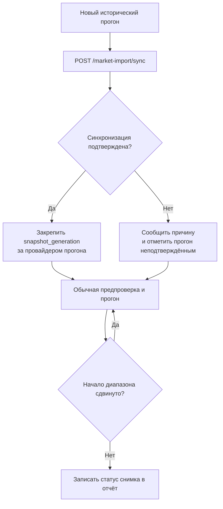

## Context

My Robot экспортирует завершённые версии свечей через свой HTTP-журнал.
Эмулятор уже переносит их в собственную БД в фоне и предоставляет
`POST /api/v1/market-import/sync`. Этот вызов читает границу журнала на момент
проверки, догоняет её и возвращает `producer_id`, `target_change_id`,
`after_id`, `synchronized` и `snapshot_generation`. Параметр
`snapshot_generation` в `GET /api/v1/candles` фиксирует выбранные свечи на
момент снимка. Без параметра клиент читает актуальное состояние БД.

В роботе `_run_history` сейчас создаёт `EmulatorClientProvider` при каждой
попытке запуска, включая повтор после сдвига начала диапазона. Предпроверка,
прогрев и торговый цикл получают разные экземпляры `HistoricalClient` от
провайдера. Снимок поэтому принадлежит **провайдеру прогона**, а не одному
HTTP-соединению или глобальной переменной.

## Goals / Non-Goals

### Goals

- Внеочередно проверять импорт до первого чтения исторических данных.
- Читать все свечи одного прогона из одного поколения канонической истории.
- Различать подтверждённый снимок и прогон по независимой БД без подтверждения
  импорта; сохранять этот факт в отчёте.
- Не повторять синхронизацию при техническом сдвиге начала того же прогона.

### Non-Goals

- Менять журнал экспорта My Robot, курсор потребителя или правила расхождения
  свечей в эмуляторе.
- Передавать карточки инструментов от My Robot: их эмулятор получает у брокера.
- Снимать снимок торгового счёта, каталога инструментов или статусов покрытия.
- Менять правила существующей предпроверки полноты диапазона и боевой режим.

## Decisions

### D1. Одна проверка на новый прогон

После выбора исторического диапазона, но до выбора инструментов, предпроверки
покрытия и чтения свечей `_run_history` создаёт провайдер и вызывает его
подготовку снимка. Вторую попытку `_run_history` после сдвига начала диапазона
выполняют с тем же провайдером и тем же поколением. Новый вызов `_run_history`
создаёт новый провайдер и заново обращается к `sync`.

### D2. Проверка ответа и отказ без ложного снимка

Подтверждением считается только успешный HTTP-ответ с `synchronized=true`,
неотрицательным целым `snapshot_generation`, целыми
`target_change_id`/`after_id` и `after_id >= target_change_id`. Неудача HTTP,
таймаут, некорректный JSON, несовместимый ответ или `synchronized=false`
означают статус `unconfirmed`; причина доступна пользователю. Прежнее
поколение не переиспользуется. Обычная предпроверка независимого исторического
источника всё равно запускается; если сам эмулятор или нужные данные
недоступны, существующие правила отказывают в запуске.

Для вызова `sync` применяется ограниченный таймаут, учитывающий догоняющую
загрузку журнала. Ошибки нового маршрута разбираются как из `detail`, так и
из стандартного `error` эмулятора. Токен экспорта My Robot в робот не
передаётся: с ним работает эмулятор.

### D3. Один снимок для всех свечных запросов

Провайдер хранит поколение только на время конкретного прогона и передаёт
его каждому новому `HistoricalClient`. Клиент добавляет
`snapshot_generation` во все страницы `GET /api/v1/candles`, сохраняя его
при пагинации, повторе после сетевой ошибки и загрузке прогрева. Без
подтверждённого поколения параметр не отправляется. Каталог инструментов
остаётся обычным: эмулятор самостоятельно получает карточки по UID.

### D4. Наблюдаемость в результате прогона

Перед началом робот сообщает статус синхронизации. `report.json` содержит
отдельный объект `market_data_sync` со статусом `synchronized` или
`unconfirmed`, `producer_id`, границей журнала, достигнутым курсором,
`snapshot_generation` и краткой причиной отказа, где значения неизвестны —
`null`. `report.txt` содержит понятную строку с тем же статусом и, при успехе,
номером снимка. Секреты и Bearer-токены в отчёт не попадают. Отчёт при
аварийном завершении сохраняет тот же статус.

## Risks / Trade-offs

- Догоняющая синхронизация может увеличить время до начала прогона. Ограниченный
  таймаут и явный статус позволяют продолжить работу с независимой БД.
- Фоновый импорт и брокерская загрузка могут продолжаться после проверки.
  Чтение по сохранённому поколению не меняется от их последующих записей.
- При неподтверждённом импорте обычные свечные запросы читают актуальную БД;
  это явно отражено в отчёте и не выдаётся за зафиксированный снимок.
- Снимок свечей не гарантирует неизменность карточек инструментов. Отсутствие
  карточки по-прежнему обнаруживает предпроверка данных.

## Validation

Проверить unit-сценарии успешного и ошибочного `sync`, строгую проверку
полей ответа, передачу поколения в каждую страницу, отсутствие параметра
при отказе и отсутствие переноса поколения между прогонами. Интеграционный
сценарий должен подтверждать один вызов `sync` при сдвиге начала, одинаковый
снимок в предпроверке и торговом цикле, а также статус в обоих форматах отчёта.
Перед реализацией и после неё выполнить `openspec validate ... --strict`.
